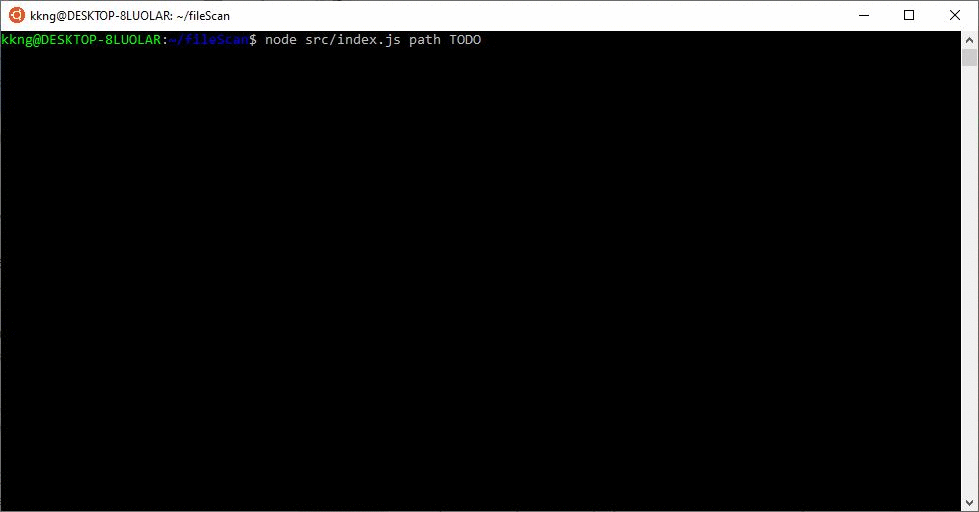
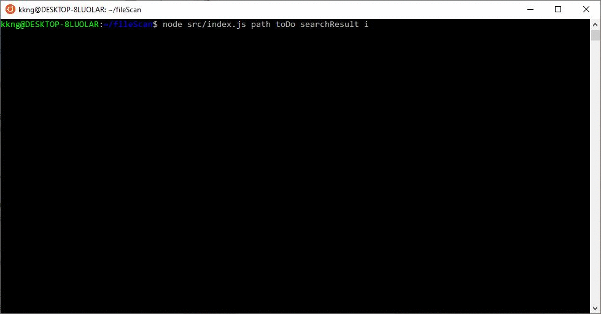

# FileScan
This is an NodeJS version 12.16.1 application to scan the file contents and output to console and a file in output folder (Default is output.txt)
 
## How to run
node src/index.js Path Keyword OutputFile Case-sensitive 

Parameter 
- Path Directory to conduct the search
- Keyword to be search for
- OutputFile [optional] file save name
- Case-sensitive [optional] default is sensitive, "i" for case-insensitive


```bash 
cd fileScan
#Case Sensitive with default file [output.txt]
node .\src\index.js path TODO   (WINDOW)
node ./src/index.js path TODO   (LINUX)
```
<p align="center">
    
<br>

```bash 
#Case Sensitive with output file name
node .\src\index.js path TODO searchResult    (WINDOW)
node ./src/index.js path TODO searchResult    (LINUX)
```

```bash 
#Case insensitive
node .\src\index.js path todo searchResult i      (WINDOW)
node ./src/index.js path todo searchResult i      (LINUX)
```
<p align="center">
    
<br>

```bash 
#Change output file name
node .\src\index.js path TODO searchResult  
```
<p align="center">
    
<br>

## Output
The output will display in the terminal and the output will also be saved to a txt file (Default is output.txt) in the output directory level

## Testing
To run eslint, jest and jest --coverage
```bash
npm test
```

To run unit test
```bash
npm run unit
```

The JSDoc for scanFile module can be found in
[https://ngkk00.github.io/fileScan/global.html#searchFiles]